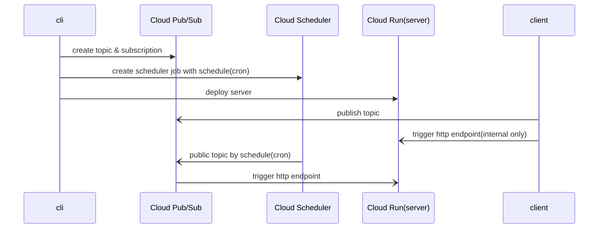

cornerstone
===========

fast and simple distributed & asynchronous & scheduled task processing system runs on serverless infrastructure.

cli
---

- [cli](./cli)

nodejs
------

* [commons](./nodejs/commons) : nodejs common module
* [starter](./nodejs/starter) : minimal framework to build task server runs on Google Cloud Run and Pub/Sub
* [client](./nodejs/client) : minimal library to invoke task which runs onb Google Cloud Run and Pub/Sub
* [sample server](./nodejs/sample/server) : sample server using @day1co/cornerstone-starter module
* [sample client](./nodejs/sample/client) : sample client using @day1co/cornerstone-client module

TODO: java
----------

* [commons](./java/commons) : java common module
* [spring-boot-autoconfigure](./java/spring-boot-autoconfigure): spring boot dependencies
* [spring-boot-starter](./java/spring-boot-starter): spring boot starter
* [spring-boot-sample-server](./java/spring-boot-sample-server)
* [spring-boot-sample-client](./java/spring-boot-sample-client)

Internals
---------

---
may the **SOURCE** be with you...
